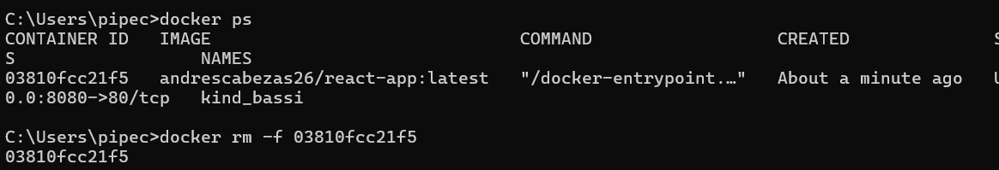

# README — React App (Docker + GitHub Actions -> Docker Hub)

> **Resumen rápido**: Este repo contiene una aplicación React dockerizada y una GitHub Action que construye la imagen y la sube a **Docker Hub** automáticamente cuando se hace push a `main`.

---

## Contenido

* **Qué se hizo** (paso a paso)
* **Requisitos**
* **Cómo levantarlo localmente**
* **GitHub Actions** (workflow usado)
* **Secrets** y permisos del token
* **Comandos útiles** (build, run, stop, remove)

---

## 1. Qué se hizo (paso a paso)

1. Fork del repo original a tu cuenta.
2. Se creó un `Dockerfile` para construir la app React y servirla con `nginx`.
3. Se añadió un workflow de GitHub Actions (`.github/workflows/docker-build-push.yml`) que:

   * hace checkout del repo,
   * configura Docker Buildx,
   * se loguea a Docker Hub usando secrets,
   * construye y hace `push` de la imagen.
4. Se agregaron los **GitHub Secrets**: `DOCKER_USERNAME` y `DOCKER_PASSWORD` (token de Docker Hub con permiso **Read & Write**).
5. Se descargó la imagen desde docker hub y se probó la imagen localmente, comprobandose que la app levanta en `http://localhost:8080`.

---

## 2. Requisitos

* `git` instalado
* `docker` (engine) instalado y corriendo
* Cuenta en **Docker Hub** (para subir la imagen)
* Secrets configurados en GitHub (repository secrets)

---

## 3. Archivos importantes

* `Dockerfile` (raíz)
* `.github/workflows/docker-build-push.yml` (workflow de CI)
* `.gitignore`

---

## 4. Dockerfile (ejemplo usado)

```dockerfile
# Etapa 1: Build
FROM node:18-alpine AS build
WORKDIR /app
COPY package*.json ./
RUN npm install
COPY . .
RUN npm run build

# Etapa 2: Servir con nginx
FROM nginx:1.24-alpine
COPY --from=build /app/build /usr/share/nginx/html
EXPOSE 80
CMD ["nginx", "-g", "daemon off;"]
```

---

## 5. Workflow de GitHub Actions (docker-build-push.yml)

Archivo: `.github/workflows/docker-build-push.yml`

```yaml
name: Build and Push Docker Image

on:
  push:
    branches: [ main ]
  pull_request:

jobs:
  docker:
    runs-on: ubuntu-latest
    steps:
      - name: Checkout
        uses: actions/checkout@v4

      - name: Set up Docker Buildx
        uses: docker/setup-buildx-action@v3

      - name: Login to Docker Hub
        uses: docker/login-action@v3
        with:
          username: ${{ secrets.DOCKER_USERNAME }}
          password: ${{ secrets.DOCKER_PASSWORD }}

      - name: Build and push
        uses: docker/build-push-action@v6
        with:
          context: .
          push: true
          tags: ${{ secrets.DOCKER_USERNAME }}/react-app:latest
```


---

## 6. GitHub Secrets y permisos del token

* Crea un **Access Token** en Docker Hub (`Settings → Security → Access Tokens`).
* Dale permiso **Read & Write** (necesario para `docker push`).
* En GitHub repo: `Settings → Secrets and variables → Actions` → añade:

  * `DOCKER_USERNAME` = tu usuario de Docker Hub
  * `DOCKER_PASSWORD` = el token que creaste

> Usa **Repository secrets** si es solo para este repo. Si tenés entornos (`dev`, `prod`) puedes usar Environment secrets.


---

## 7. Cómo probar localmente (comandos)
Probar pull (desde otra máquina):

```bash
docker pull <tu-usuario>/react-app:latest
docker run -dp 8080:80 <tu-usuario>/react-app:latest
```


---

## 8. Parar y eliminar contenedores (comandos útiles)

Listado de contenedores corriendo:

```bash
docker ps
```

Parar un contenedor (por ID o NAME):

```bash
docker stop <CONTAINER_ID>
```

Eliminar un contenedor:

```bash
docker rm <CONTAINER_ID>
```

Forzar stop + remove en un solo comando:

```bash
docker rm -f <CONTAINER_ID>
```
